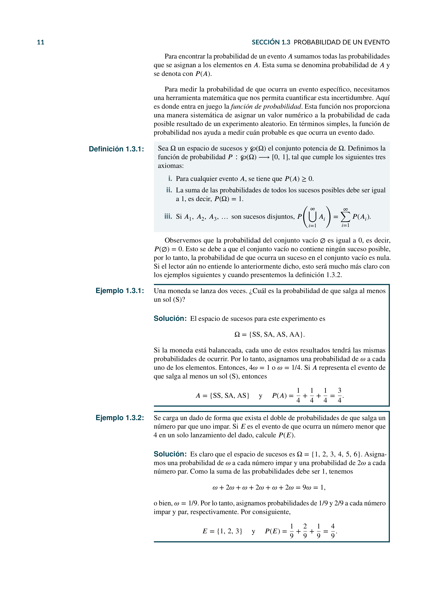
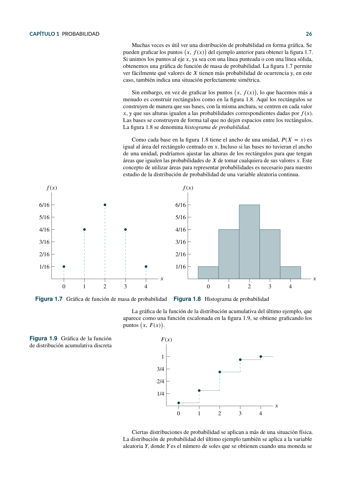
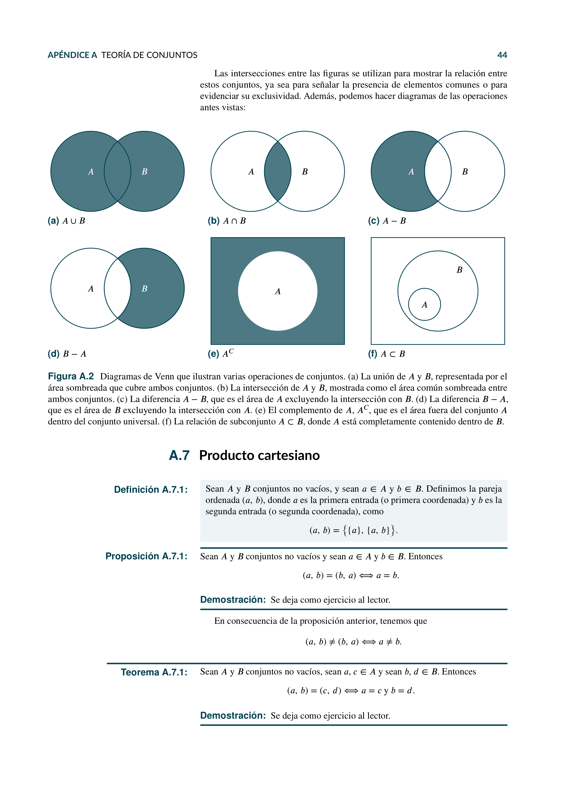
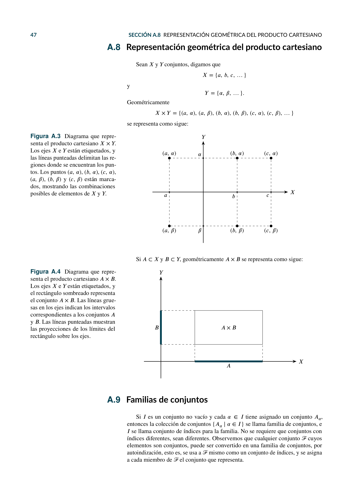

# Ingeniería Económica

Este repositorio contiene el material y el código asociado al libro de *Ingeniería Económica*, el cual está diseñado para los estudiantes y profesionales interesados en la aplicación de conceptos económicos en la ingeniería. Esta obra se centra principalmente en los temas de Probabilidad y Teoría de Juegos, los cuales forman la base del análisis económico en escenarios de incertidumbre y competencia. Además, incluye un apéndice dedicado a la Teoría de Conjuntos.

## Contenido del Libro

### Capítulo 1: Probabilidad

1. **Fundamentos de la probabilidad**: Definiciones, axiomas y teoremas.
2. **Distribuciones de probabilidad**: Discretas y continuas, distribuciones comunes.
3. **Teorema de Bayes**: Aplicaciones y ejemplos prácticos.
4. **Variables aleatorias**: Esperanza matemática, varianza y desviación estándar.

### Capítulo 2: Teoría de Juegos

1. **Juegos estáticos y dinámicos**: Juegos de estrategia pura y mixta.
2. **Equilibrio de Nash**: Conceptos y métodos para encontrarlo.
3. **Juegos cooperativos y no cooperativos**: Soluciones y estrategias.
4. **Aplicaciones de la teoría de juegos**: Economía, negociación y competencia.

## Apéndice

- **Teoría de conjuntos**: Conceptos básicos, operaciones y propiedades fundamentales.

## Cómo usar

Estas notas se presentan en formato PDF para facilitar su uso y visualización. Puedes clonarlas o descargarlas para estudiarlas a tu propio ritmo.

## Descarga

Puedes descargar las notas haciendo clic en el enlace que se encuentra al principio de este repositorio.

## Contribuciones

Si tienes sugerencias o mejoras, siéntete libre de abrir una *issue* o hacer un *pull request*. ¡Tu contribución es bienvenida!